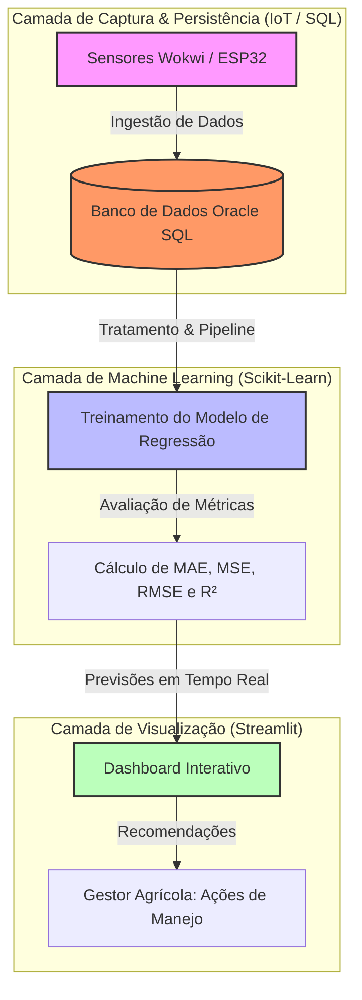

# FIAP - Faculdade de Informática e Administração Paulista

<p align="center">
<a href= "https://www.fiap.com.br/"></a>
</p>

<br>

# Cap 1 - Memorizando e Aprendendo com os Dados da Farm Tech Solutions

## 👨‍🎓 Integrantes: 
- <a href="https://www.linkedin.com/">Arthur Prudêncio Soares — RM569295</a>
- <a href="https://www.linkedin.com/">Caroline Coelho Mendes — RM570370</a>
- <a href="https://www.linkedin.com/">Leandro Paiva — RM572159</a> 
- <a href="https://www.linkedin.com/">Lucas Viana de Lima — RM571835</a> 
- <a href="https://www.linkedin.com/">Matheus Tavares Lima — RM572808</a>

## 👩‍🏫 Professores:
### Tutor(a) 
- <a href="https://www.linkedin.com/">Lucas Gomes</a>
### Coordenador(a)
- <a href="https://www.linkedin.com/">Prof. Dr. Rodrigo Mangoneli</a>

---

## FarmTech Solutions - Assistente Agrícola Inteligente
Este repositório contém a consolidação técnica do projeto FarmTech Solutions, marcando o início da transição para a Agricultura Cognitiva. O objetivo principal é transformar dados agrícolas brutos em conhecimento acionável, utilizando modelos de Inteligência Artificial para prever variáveis críticas e apoiar a tomada de decisão automatizada no campo.

A aplicação integra a coleta/simulação de dados de sensores IoT, armazenamento em banco de dados estruturado, pipelines de Machine Learning (Regressão) e uma interface interativa para gestores agrícolas.

---

## 1. Entendimento do Problema
No cenário do agronegócio moderno, a busca por eficiência e sustentabilidade exige que a tomada de decisão deixe de ser puramente intuitiva ou reativa. 
Fatores climáticos e de solo, como variações bruscas de umidade e desequilíbrios de pH, impactam diretamente o rendimento final das culturas. 
Sem uma análise preditiva centralizada, gestores agrícolas enfrentam dificuldades para antecipar necessidades de irrigação e manejo, resultando em desperdício de recursos (água, fertilizantes) ou perdas severas na produtividade do campo.

## 2. Definição da Solução
A solução desenvolvida dentro do ecossistema FarmTech Solutions consiste em um Assistente Agrícola Inteligente. 
O sistema marca o início da Agricultura Cognitiva ao integrar sensores IoT (reais ou simulados via ESP32 no Wokwi) a um banco de dados estruturado e a um pipeline de Machine Learning supervisionado (Regressão). 
Utilizando a biblioteca Scikit-Learn, o ecossistema prevê variáveis críticas e sugere ações automáticas de manejo, exibindo todos os insights gerados de forma interativa através de um dashboard em Streamlit.

## 3. Personas e User Stories
* Gestor Agrícola: "Como gestor do campo, quero visualizar métricas de desempenho, gráficos de correlação e previsões de rendimento em tempo real para planejar as ações de irrigação e fertilização de forma preditiva e sustentável."
* Engenheiro de Dados / Agrônomo: "Como técnico, quero que os dados coletados pelos sensores IoT (ou simuladores) alimentem automaticamente um banco de dados estruturado, permitindo que os modelos de IA gerem recomendações de manejo precisas."

## 4. Estruturação dos Dados (Dataset & Banco de Dados)
O projeto utiliza uma estrutura lógica e relacional baseada nos conceitos de Cognitive Data Science para persistir e processar as métricas coletadas pelas camadas de sensores.

Dicionário de Dados do Ecossistema

| Nome da Coluna / Campo | Tipo de Dado | Descrição | Exemplo |
|:---|:---|:---|:---|
| `umidade_solo` | NUMERIC(10,2) | Percentual de umidade do solo capturado (0 a 100%) | `65.40` |
| `ph_solo` | NUMERIC(10,2) | Escala de pH do solo monitorado (0 a 14) | `6.50` |
| `nivel_n` | INTEGER | Presença de Nitrogênio detectada pelo sensor (0 ou 1) | `1` |
| `nivel_p` | INTEGER | Presença de Fósforo detectada pelo sensor (0 ou 1) | `0` |
| `nivel_k` | INTEGER | Presença de Potássio detectada pelo sensor (0 ou 1) | `1` |
| `volume_irrigacao_litros` | NUMERIC(10,2) | Variável predita: Volume de água recomendado em litros | `45.22` |
| `produtividade_kg` | NUMERIC(10,2) | Variável predita: Estimativa de rendimento da safra em kg | `120.50` |

## 5. Arquitetura da Solução & Pipeline de Dados
O fluxo de dados integra a coleta na ponta (IoT), a persistência relacional e a camada preditiva que abastece a interface do usuário:



## 6. Interface e Resultados do Dashboard (Streamlit)
  A interface interativa foi construída para traduzir a complexidade estatística dos modelos de regressão em respostas visuais diretas para o negócio do agronegócio:
  
  Métricas e Gráficos de Correlação
  
  A tela principal do dashboard apresenta a aderência do modelo (Métricas de Erro e $R^2$) e gráficos dinâmicos relacionando umidade, pH e produtividade.
  
  Figura 1: Interface do Dashboard Streamlit exibindo tendências de produtividade e previsões.
  
  Ingestão de Dados e Conexão Relacional:

  Demonstração da arquitetura de integração entre o ecossistema Python (Pandas/Streamlit) e o banco de dados Oracle Database executado em container Docker, evidenciando o consumo e tratamento das tabelas estruturadas de histórico agrícola em tempo real.
  
  Figura 2: Monitoramento da ingestão automática de dados originados dos sensores.


## 7. Estrutura de Pastas do Repositório
```text
├── data/                             # Datasets utilizados para treino e validação
│   └── historico_agricola.csv
├── database/                         # Modelagem e scripts SQL
│   └── historico_agricola.sql
├── images/                           # Imagens, capturas de tela e gráficos da aplicação
│   └── 
├── CAp 1.py                          # Aplicação principal (Dashboard Streamlit)
└── README.md                         # Documentação oficial do projeto
├── database_setup.py                 # Script de carga inicial (ingestão de dados)
├── requirements.txt                  # Dependências das bibliotecas Python
```
## 8. Como Executar o Projeto
Pré-requisitos

* Python 3.9 ou superior instalado.

* Banco de dados configurado de acordo com as especificações da camada de dados.

1 - Passo a Passo
Clonar o Repositório:
```text
Bash
git clone https://github.com/seu-usuario/farmtech-solutions.git
cd farmtech-solutions
```
2 - Configurar o Ambiente Virtual e Dependências:
```text
Bash
# No seu MacBook M4 (macOS), utilize:
python3 -m venv .venv
source .venv/bin/activate

# Instalação das dependências necessárias:
pip install streamlit pandas numpy matplotlib seaborn scikit-learn oracledb
```
3 - Executar a Interface do Dashboard:
```text
Bash
streamlit run "CAp 1.py"
```

## 9. Apresentação em Vídeo e Entregáveis
Os vídeos demonstrativos detalhando o domínio técnico, pipelines implementados e funcionamento da solução estão disponíveis nos links abaixo:
